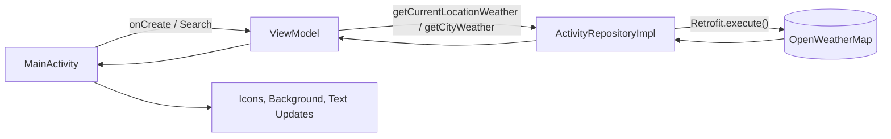

# 🌦️ Weather (Android)

A minimal, clean Android weather app I built a little over two years ago to demonstrate my **coding style and project structure**.  
It fetches current weather by **device location** or **city name**, and dynamically changes UI (icon & background) based on the weather condition.

> 🕐 This repository is intentionally left “as-is” to reflect my development style and architecture decisions from that period.

---

## ✨ Features

- Current weather by **GPS** (FusedLocationProviderClient)
- Weather by **city name** (SearchView)
- Displays:
  - Temperature (°C / °F)
  - “Feels like” temperature
  - Pressure, humidity, wind speed
  - Sunrise / sunset times
  - Country and city name
- **Dynamic UI:** background and icons adapt to weather code (`weather[0].id`)
- Clean state-based UI with Loading / Success / Error

---

## 🧱 Tech Stack

- **Kotlin**
- **ViewBinding**
- **Coroutines + Flow**
- **Retrofit** + **GsonConverterFactory**
- **Google Play Services Location**
- **EasyPermissions** for runtime permissions

---

## 🗺️ Architecture

Simple **MVVM** pattern:

```
MainActivity  →  MainActivityViewModel  →  ActivityRepositoryImpl  →  Retrofit ApiInterface
      ↑                                                              ↓
  ViewBinding & State UI                                       OpenWeatherMap /weather
```

### Base State
```kotlin
sealed class BaseState : Parcelable {
    object Working : BaseState()
    object Loading : BaseState()
    class Success(val weatherData: WeatherData) : BaseState()
    class Error(val message: String) : BaseState()
}
```

---

## 🔌 API

- **Base URL:** `https://api.openweathermap.org/data/2.5/`
- **Endpoints:**
  - `/weather?lat={lat}&lon={lon}&APPID={key}`
  - `/weather?q={city}&APPID={key}`

> API key is set in `ui/Constants.kt` → `API_KEY`.

---

## 📲 Permissions

Declared in `AndroidManifest.xml`:
- `INTERNET`
- `ACCESS_COARSE_LOCATION`
- `ACCESS_FINE_LOCATION`
- `ACCESS_BACKGROUND_LOCATION` *(legacy; not required for one-shot location)*

Runtime permissions handled via **EasyPermissions** with fallback to App Settings if denied.

---

## 📦 Project Structure

```
app/
 └─ src/main/
     ├─ AndroidManifest.xml
     ├─ java/com/crazycat/weather/
     │   ├─ activity/
     │   │   ├─ MainActivity.kt
     │   │   └─ domain/
     │   │       ├─ ActivityRepository.kt
     │   │       └─ ActivityRepositoryImpl.kt
     │   ├─ core/               // ResourceHolder abstraction
     │   ├─ model/              // WeatherData and nested models
     │   ├─ presentation/       // BaseState
     │   ├─ ui/
     │   │   ├─ Constants.kt
     │   │   ├─ delegate/       // viewModelCreator, viewBinding delegate
     │   │   └─ utils/          // show/gone, toasts, snackbar
     │   └─ utilites/
     │       ├─ ApiInterface.kt
     │       ├─ ApiUtilities.kt
     │       └─ TrackingUtility.kt
     └─ res/ (layouts, drawables, strings, etc.)
```

---

## 🔄 Data Flow



---

## 🖥️ UI Behavior

- Enter a **city name** → fetch weather → update UI  
- Tap **“Current Location”** → refresh by coordinates  
- Progress indicator for loading  
- Background & icon switch by weather code:
  - ⚡ Thunderstorm (200–232)
  - 🌧️ Drizzle (300–321)
  - 🌦️ Rain (500–531)
  - ❄️ Snow (600–622)
  - 🌫️ Atmosphere (701–781)
  - ☀️ Clear (800)
  - ☁️ Clouds (801–804)
  - ❔ Unknown (fallback)

---

## ▶️ How to Run

1. Add your OpenWeatherMap API key:
   ```kotlin
   const val API_KEY = "YOUR_KEY"
   ```
2. Build & run on a device or emulator (location enabled).
3. Allow location permissions when prompted.

> Note: This project keeps its original behavior with manual Kelvin → Celsius conversion to preserve historical implementation.

---
